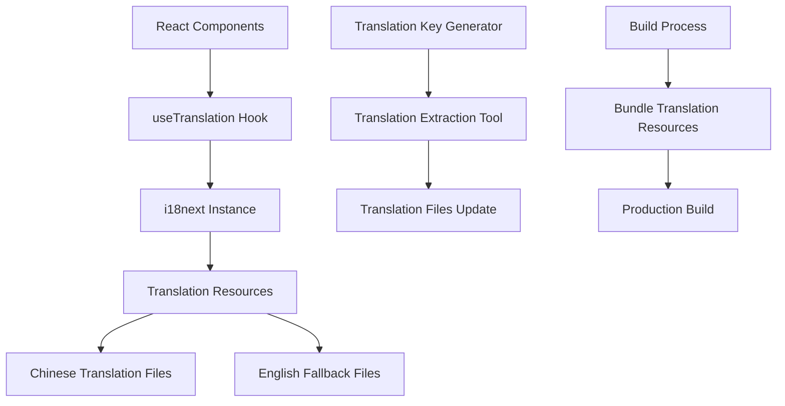

# Design Document

## Overview

This design outlines the implementation of a comprehensive Chinese localization system for the Claudia application. The solution will use React i18next for internationalization, providing a maintainable and scalable approach to translate all user-facing text from English to Chinese.

The design focuses on minimal code changes while maximizing translation coverage, using a centralized translation management system that can be easily maintained and extended.

## Architecture

### Translation System Architecture



### Component Integration Pattern

- **Hook-based Translation**: Use `useTranslation` hook in functional components
- **Translation Key Convention**: Hierarchical keys matching component structure
- **Fallback Strategy**: English text as fallback when Chinese translation missing
- **Context-aware Translation**: Different translations for same terms in different contexts

## Components and Interfaces

### Core Translation Infrastructure

#### 1. i18next Configuration
```typescript
interface I18nConfig {
  lng: string;
  fallbackLng: string;
  resources: {
    zh: { translation: TranslationResource };
    en: { translation: TranslationResource };
  };
  interpolation: {
    escapeValue: boolean;
  };
}
```

#### 2. Translation Hook Interface
```typescript
interface UseTranslationReturn {
  t: (key: string, options?: any) => string;
  i18n: i18n;
  ready: boolean;
}
```

#### 3. Translation Resource Structure
```typescript
interface TranslationResource {
  common: CommonTranslations;
  navigation: NavigationTranslations;
  projects: ProjectTranslations;
  sessions: SessionTranslations;
  settings: SettingsTranslations;
  agents: AgentTranslations;
  errors: ErrorTranslations;
  actions: ActionTranslations;
}
```

### Translation Key Organization

#### Hierarchical Key Structure
- `common.*` - Common UI elements (buttons, labels, etc.)
- `navigation.*` - Navigation and menu items
- `projects.*` - Project-related text
- `sessions.*` - Session management text
- `settings.*` - Settings and configuration text
- `agents.*` - Agent-related text
- `errors.*` - Error messages
- `actions.*` - Action buttons and confirmations

#### Example Key Mapping
```typescript
// English: "Welcome to Claudia"
// Key: "navigation.welcome.title"
// Chinese: "欢迎使用 Claudia"

// English: "Create New Session"
// Key: "actions.session.create"
// Chinese: "新建会话"
```

## Data Models

### Translation File Structure

#### Chinese Translation File (`zh.json`)
```json
{
  "common": {
    "loading": "加载中...",
    "error": "错误",
    "success": "成功",
    "cancel": "取消",
    "confirm": "确认",
    "back": "返回",
    "next": "下一步",
    "save": "保存",
    "delete": "删除",
    "edit": "编辑",
    "create": "创建"
  },
  "navigation": {
    "welcome": {
      "title": "欢迎使用 Claudia",
      "subtitle": "Claude Code 会话浏览器"
    },
    "projects": {
      "title": "CC 项目",
      "subtitle": "浏览您的 Claude Code 会话"
    },
    "agents": {
      "title": "CC 智能代理",
      "subtitle": "管理您的智能代理"
    }
  },
  "projects": {
    "list": {
      "title": "项目列表",
      "empty": "在 ~/.claude/projects 中未找到项目",
      "loadError": "加载项目失败。请确保 ~/.claude 目录存在。"
    },
    "session": {
      "new": "新建 Claude Code 会话",
      "running": "运行中的会话",
      "loadError": "加载该项目的会话失败。"
    }
  }
}
```

#### English Fallback File (`en.json`)
```json
{
  "common": {
    "loading": "Loading...",
    "error": "Error",
    "success": "Success",
    "cancel": "Cancel",
    "confirm": "Confirm",
    "back": "Back",
    "next": "Next",
    "save": "Save",
    "delete": "Delete",
    "edit": "Edit",
    "create": "Create"
  }
}
```

### Component Translation Integration

#### Translation Hook Usage Pattern
```typescript
// Before
const Component = () => {
  return <h1>Welcome to Claudia</h1>;
};

// After
const Component = () => {
  const { t } = useTranslation();
  return <h1>{t('navigation.welcome.title')}</h1>;
};
```

## Error Handling

### Translation Error Handling Strategy

#### 1. Missing Translation Fallback
- Display English text when Chinese translation missing
- Log missing translation keys for development
- Graceful degradation without breaking UI

#### 2. Translation Loading Errors
- Show loading state while translations load
- Fallback to English if translation files fail to load
- Error boundary to catch translation-related crashes

#### 3. Invalid Translation Keys
- Return key name if translation not found
- Development warnings for invalid keys
- Type-safe translation keys using TypeScript

### Error Message Localization

#### Error Categories
- **System Errors**: File system, network, API errors
- **Validation Errors**: Form validation, input errors
- **User Action Errors**: Permission, operation failures
- **Loading Errors**: Resource loading failures

#### Error Translation Examples
```typescript
const errorTranslations = {
  "errors.system.fileNotFound": "文件未找到",
  "errors.system.networkError": "网络连接错误",
  "errors.validation.required": "此字段为必填项",
  "errors.validation.invalidFormat": "格式无效",
  "errors.user.permissionDenied": "权限不足",
  "errors.loading.projectsFailed": "加载项目失败"
};
```

## Testing Strategy

### Translation Testing Approach

#### 1. Unit Tests for Translation Functions
- Test translation key resolution
- Test fallback behavior
- Test interpolation and formatting

#### 2. Component Translation Tests
- Verify translated text renders correctly
- Test translation context switching
- Validate Chinese character display

#### 3. Integration Tests
- End-to-end translation workflow
- Translation file loading
- Language switching functionality

#### 4. Visual Regression Tests
- Chinese text layout and spacing
- UI component sizing with Chinese text
- Font rendering and readability

### Test Implementation Examples

#### Translation Hook Tests
```typescript
describe('useTranslation', () => {
  it('should return Chinese translation', () => {
    const { result } = renderHook(() => useTranslation());
    expect(result.current.t('common.loading')).toBe('加载中...');
  });

  it('should fallback to English when Chinese missing', () => {
    const { result } = renderHook(() => useTranslation());
    expect(result.current.t('missing.key')).toBe('missing.key');
  });
});
```

#### Component Translation Tests
```typescript
describe('App Component', () => {
  it('should display Chinese welcome message', () => {
    render(<App />);
    expect(screen.getByText('欢迎使用 Claudia')).toBeInTheDocument();
  });
});
```

### Performance Considerations

#### Translation Bundle Optimization
- Lazy load translation resources
- Split translations by feature/route
- Minimize bundle size impact
- Cache translation resources

#### Runtime Performance
- Memoize translation functions
- Optimize re-renders on language change
- Efficient key lookup algorithms
- Memory usage optimization

### Implementation Phases

#### Phase 1: Core Infrastructure
- Install and configure i18next
- Set up translation file structure
- Implement translation hooks
- Create base translation files

#### Phase 2: Component Migration
- Migrate main navigation components
- Update common UI elements
- Translate error messages
- Update form labels and buttons

#### Phase 3: Feature-Specific Translation
- Translate project management features
- Update session management text
- Localize settings and configuration
- Translate agent-related content

#### Phase 4: Polish and Optimization
- Review translation quality
- Optimize bundle size
- Add missing translations
- Performance optimization